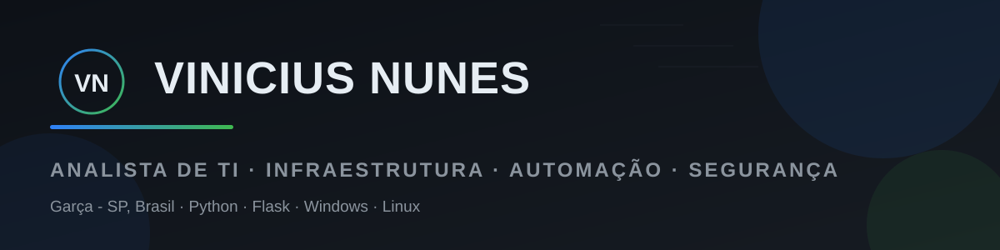

<div align="center">



[](https://www.linkedin.com/in/vinicius-nunes-da-silva-2049792b8/)
[](https://vinenuness.github.io/portfolio/)
[](https://github.com/Vinenuness/ativofix)

</div>

## 👨‍💻 Sobre mim

Analista de TI com atuação prática em **suporte N2/N3, infraestrutura e automação**, construindo soluções que resolvem problemas reais da operação — do atendimento ao usuário até o sistema que organiza tudo isso.

- 🔧 **Suporte e infraestrutura** — Windows, Linux, redes e hardening de sistemas
- 🐍 **Automação com Python** — agente de inventário, scripts e integrações
- 🌐 **Desenvolvimento web** — Flask e APIs para ferramentas internas de TI
- 🔐 **Segurança** — boas práticas, isolamento de dados e hardening
- 📍 Garça - SP, Brasil

---

## 🚀 Projeto em destaque

<div align="center">

### [AtivoFix](https://github.com/Vinenuness/ativofix) — *Tecnologia em Movimento*

**Plataforma completa de gestão de TI: inventário automático, help desk e relatórios em um só painel.**

*Software real, **em produção**, usado por equipes com múltiplas unidades.*

</div>

| | |
|---|---|
| 🖥️ | **Inventário automático** — agente Windows em Python coleta hardware, software e status dos PCs |
| 🎫 | **Help desk** — portal público, SLA, anexos e pesquisa de satisfação |
| 🏢 | **Multi-empresa** — isolamento total de dados por tenant |
| 📄 | **Relatórios PDF** — com marca e filtros por unidade/período |
| 🔐 | **Produção** — Nginx + TLS, systemd, backups e rate limiting |

```text
python · flask · sqlite · nginx · gunicorn · systemd · pyinstaller
```

<p align="center">
  <a href="https://github.com/Vinenuness/ativofix">
    
  </a>
</p>

---

## 💼 Experiência

### 🏥 AHBB | Rede Santa Casa — **Analista de TI** · `2025 — Atual`

> Suporte N3, infraestrutura e implantação de sistemas hospitalares em ambiente de saúde.

- Desenvolvimento de **sistemas web internos e automações em Python** — economia estimada de **15h/semana** em processos manuais
- Implantação de sistemas hospitalares: infraestrutura, testes e pós-go-live — **redução de 30% no tempo de implantação** com mapeamento de fluxos
- Administração do **Nextcloud corporativo**: permissões, backups e LGPD
- Suporte N3 e alinhamento com a gestão de TI em decisões técnicas e de segurança

### 💻 Freelance — **Desenvolvedor & Consultor de TI** · `Mar/2022 — Atual`

> Projetos sob demanda para pequenos negócios, unindo desenvolvimento, infraestrutura e consultoria.

- Soluções web em **Python/Flask** com integração a bancos SQL
- Automação de processos, redes locais, hardware e boas práticas de segurança

### 🏛️ Prefeitura de Garça — **Agente Comunitário de Saúde** · `Ago/2022 — Nov/2025`

> Experiência intensiva com dados, sistemas governamentais e relatórios gerenciais.

- Consolidação de dados e **Excel avançado** para indicadores gerenciais
- Operação de sistemas governamentais (Gov.br / e-SUS) e integridade de registros

<sub>*Trajetória anterior em atendimento ao cliente e eletrônica industrial (ERP TOTVS Protheus) — base prática que sustenta a visão de processo e contato com usuário.*</sub>

---

## 🎓 Formação & Certificações

| Formação | Instituição |
|---|---|
| 🎓 **MBA em Gestão de TI** | Unicorp Faculdades |
| 🎓 **Pós-graduação em Engenharia de Software** | Unicorp Faculdades |
| 🎓 **Análise e Desenvolvimento de Sistemas** | UNIVEM — Marília/SP |
| 🔧 **Técnico em Eletrônica** | ETEC Monsenhor Antônio Magliano — Garça/SP |

<details>
<summary><strong>📜 Certificações e cursos (destaques)</strong></summary>

| Área | Curso | Instituição |
|---|---|---|
| 🛠 Suporte | Technical Diagnostics and Troubleshooting Techniques | Microsoft · 2026 |
| 🛠 Suporte | Suporte técnico para hardware e software | Dell Technologies · 2026 |
| 🛠 Suporte | Google Technical Support Fundamentals | Coursera · 2024 |
| 🔐 Segurança | Hackers do Bem — Formação e Nivelamento | RNP · 2024 |
| 🔐 Segurança | Por Dentro da Segurança Cibernética | Senai SP · 2024 |
| 📊 Dados | Análise de Dados no Power BI | Fundação Bradesco · 2024 |
| 📊 Dados | Fundamentos de Data Science e IA | Data Science Academy · 2024 |
| 🐍 Automação | Programação Python do Zero ao Avançado + Projetos Reais | Udemy · 2024 |

</details>

---

## 🧰 Outros projetos

| Projeto | O que é |
|---|---|
| 🖥️ [**painel-inventario**](https://github.com/Vinenuness/painel-inventario) | Painel web em Flask para inventário de PCs e execução remota de scripts via agente Windows |
| 🛠️ [**it-helpdesk-toolkit-web**](https://github.com/Vinenuness/it-helpdesk-toolkit-web) | Ferramentas web em Flask para diagnóstico de rede e suporte técnico |
| 🌐 [**Limpa-rede**](https://github.com/Vinenuness/Limpa-rede) | Diagnóstico e reparo de rede para Windows (DNS, hosts) com modo de simulação |
| ⚡ [**optimizer-win**](https://github.com/Vinenuness/optimizer-win) | Otimização de desempenho do Windows 10/11 em PowerShell nativo |
| 🎨 [**zion-arquitetura**](https://github.com/Vinenuness/zion-arquitetura) | Site institucional responsivo para escritório de arquitetura |
| 📄 [**portfolio**](https://github.com/Vinenuness/portfolio) | Meu portfólio profissional — site estático em HTML/CSS/JS puro |

---

## 🛠 Tecnologias

**Linguagens & Frameworks**


**Infra & Ferramentas**


---

## 📊 Estatísticas

<div align="center">


</div>

---

<div align="center">

**"Tecnologia resolve; processos bem pensados sustentam."**

📍 Garça - SP · 💼 [LinkedIn](https://www.linkedin.com/in/vinicius-nunes-da-silva-2049792b8/) · 🌐 [Portfólio](https://vinenuness.github.io/portfolio/)

</div>
